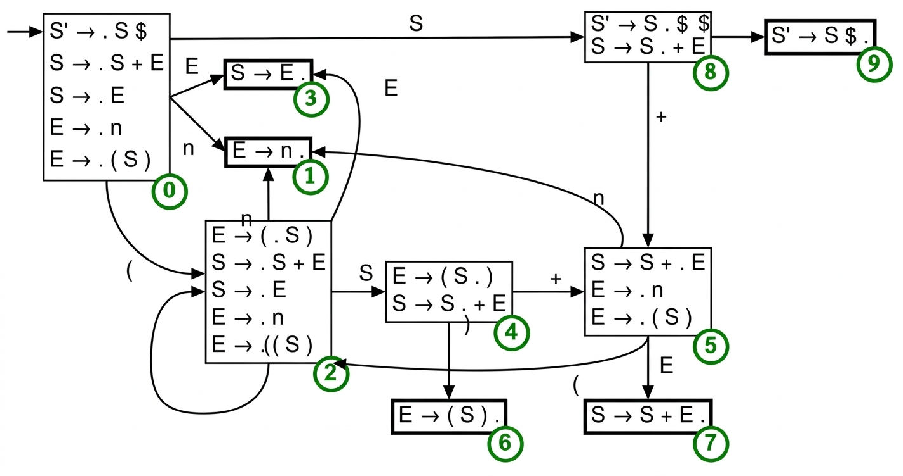

# Objetivos

## Objetivos

- Apresentar a estratégia de análise bottom-up

- Apresentar o algoritmo CYK e a Forma Normal de Chomsky

- Apresentar os algoritmos LR(0) e SLR

# Motivação

## Limitações: Top-Down

- Analisadores **LL** exigem transformações na gramática
  - Remoção de recursão à esquerda
  - Fatoração à esquerda

## Limitações: Top-Down

- Decisão com apenas **1 token de lookahead**
- Algumas gramáticas são inerentemente não-LL(1)

## A Ideia Bottom-Up

- Analisadores **bottom-up** lêem um prefixo maior antes de decidir
- Suportam **recursão à esquerda** naturalmente

## A Ideia Bottom-Up

- Constroem uma **derivação mais à direita invertida**
- Cada redução constrói um pedaço da árvore sintática

## Der. à Direita Invert.

Gramática de exemplo (não-LL(1)):

$$\begin{array}{lcl}
S &\to& S + E \mid E \\
E &\to& (S) \mid n
\end{array}$$

## Der. à Direita Invert.

Analisando `(1) + 2`:

```
S'  =>  S  =>  S+E  =>  S+2  =>  E+2  =>  (S)+2  =>  (E)+2  =>  (1)+2
```

O analisador constrói essa derivação de baixo para cima, da direita para a esquerda.

# Forma Normal de Chomsky

## O Que é FNC?

Uma gramática está na **Forma Normal de Chomsky (FNC)** quando toda produção tem a forma:

$$A \to BC \qquad \text{ou} \qquad A \to a$$

onde $A$, $B$, $C$ são não-terminais e $a$ é um terminal.

## Por Que FNC?

- Toda árvore de derivação de uma cadeia de comprimento $n$ tem exatamente $2n-1$ nós internos
- Isso torna o espaço de busca finito e bem estruturado
- **Requisito do algoritmo CYK**

## Conversão para FNC

4 transformações em sequência:

1. **Novo símbolo inicial**: adicionar $S_0 \to S$
2. **Eliminar $\varepsilon$-produções**: remover $A \to \lambda$
3. **Eliminar produções unitárias**: remover $A \to B$
4. **Binarizar e terminalizar**: converter $A \to X_1 \cdots X_k$ com $k \geq 3$

## Exemplo de Conversão

Gramática: $S \to aSb \mid ab$

## Exemplo de Conversão

Após binarização e terminalização:

$$\begin{array}{lcl}
S   &\to& N_a\,A_1 \mid N_a\,N_b \\
A_1 &\to& S\,N_b \\
N_a &\to& a \\
N_b &\to& b
\end{array}$$

Linguagem: $\{a^n b^n \mid n \geq 1\}$

# Algoritmo CYK

## A Ideia Central

Dado $G$ em FNC e $w = a_1 \cdots a_n$:

**Tabela triangular** $T[i][j]$ = conjunto de não-terminais que derivam $a_i \cdots a_j$

$$T[i][j] = \{A \in V \mid A \Rightarrow^* a_i \cdots a_j\}$$

**Aceita** se $S \in T[1][n]$

## CYK: Caso Base

Para cada posição $i = 1, \ldots, n$:

$$T[i][i] = \{A \mid A \to a_i \in G\}$$

## CYK: Caso Indutivo

Para cada comprimento $\ell = 2, \ldots, n$, cada início $i$, $j = i + \ell - 1$:

$$T[i][j] = \bigcup_{k=i}^{j-1} \{A \mid A \to BC \in G,\; B \in T[i][k],\; C \in T[k+1][j]\}$$

## CYK e Programação Dinâmica

| Componente | No CYK |
|---|---|
| Subproblema | Calcular $T[i][j]$ |
| Subestrutura | $A \in T[i][j]$ depende de $T[i][k]$ e $T[k+1][j]$ |
| Sobreposição | $T[i][j]$ é consultado por múltiplos subproblemas maiores |

A **ordem** de preenchimento: comprimentos crescentes garante que os subproblemas menores sejam resolvidos primeiro.

## Complexidade

- **$O(n^2)$** células na tabela
- **$O(n)$** pontos de divisão $k$ por célula
- **$O(|G|)$** produções verificadas por divisão
- **Total: $O(n^3 |G|)$**

# Exemplo CYK

## Gramática e Entrada

Gramática (FNC) para $\{a^n b^n\}$:

$$\begin{array}{lcl}
S   &\to& N_a A_1 \mid N_a N_b \\
A_1 &\to& S\,N_b \\
N_a &\to& a \\
N_b &\to& b
\end{array}$$

Entrada: **aabb** ($n=4$)

## Passo Base

| $i$ | $j$ | $a_i$ | $T[i][j]$ |
|---|---|---|---|
| 1 | 1 | a | $\{N_a\}$ |
| 2 | 2 | a | $\{N_a\}$ |
| 3 | 3 | b | $\{N_b\}$ |
| 4 | 4 | b | $\{N_b\}$ |

## Comprimento 2

| $i$ | $j$ | Subcad. | $T[i][j]$ |
|---|---|---|---|
| 1 | 2 | aa | $k{=}1$: $N_a, N_a$ — sem produção — $\emptyset$ |
| 2 | 3 | ab | $k{=}2$: $N_a, N_b$ — $S \to N_a N_b$ — $\{S\}$ |
| 3 | 4 | bb | $k{=}3$: $N_b, N_b$ — sem produção — $\emptyset$ |

## Comprimento 3

| $i$ | $j$ | Subcad. | $T[i][j]$ |
|---|---|---|---|
| 1 | 3 | aab | divisões: tudo vazio — $\emptyset$ |
| 2 | 4 | abb | $k{=}3$: $S, N_b$ — $A_1 \to S\,N_b$ — $\{A_1\}$ |

## Comprimento 4

| $i$ | $j$ | Subcad. | $T[i][j]$ |
|---|---|---|---|
| 1 | 4 | aabb | $k{=}1$: $N_a, A_1$ — $S \to N_a A_1$ — $\{S\}$ ✓ |

**$S \in T[1][4]$ → aabb aceita!**

# Implementação CYK

## Tipo da Tabela

```haskell
type CYKTable = Map (Int, Int) (Set String)
```

## Caso Base

```haskell
base = Map.fromList
    [ ((i, i), Set.fromList
          [ lhs
          | (lhs, prods) <- Map.toList g
          , [Terminal tok] `elem` prods
          ])
    | (i, tok) <- indexed
    ]
```

## Caso Indutivo

```haskell
fillSpan tbl (i, j) =
    let new = Set.fromList
                [ lhs
                | k <- [i..j-1]
                , let bs = look (i, k)   tbl
                , let cs = look (k+1, j) tbl
                , (lhs, b, c) <- binaryProds
                , Set.member b bs
                , Set.member c cs
                ]
    in Map.insertWith Set.union (i, j) new tbl
```

## Aceitação

```haskell
cykParse :: Grammar -> String -> [String] -> CYKResult
cykParse g start tokens
    | Set.member start topCell = CYKAccept
    | otherwise                = CYKReject
  where
    topCell = fromMaybe Set.empty
                (Map.lookup (1, length tokens) tbl)
    tbl     = buildTable g tokens
```

# Analisadores LR: Shift-Reduce

## A Ideia Shift-Reduce

Analisadores LR **pré-computam** toda a estrutura de predição em um autômato finito:

- Estado do analisador: uma **pilha de estados**
- Duas ações: **shift** (consumir token) e **reduce** (aplicar produção)

## A Ideia Shift-Reduce

Em qualquer ponto:
$\underbrace{\alpha}_{\text{pilha}} \cdot \underbrace{\beta}_{\text{entrada}}$ é
uma forma sentencial direita

## Trace Shift-Reduce para `(1)+2`

| Pilha | Entrada | Ação             |
| ----- | ------- | ---------------- |
|       | `(1)+2` | shift            |
| `(`   | `1)+2`  | shift            |
| `(1`  | `)+2`   | reduce $E \to n$ |

## Trace Shift-Reduce para `(1)+2`

| Pilha | Entrada | Ação             |
| ----- | ------- | ---------------- |
| `(1`  | `)+2`   | reduce $E \to n$ |
| `(E`  | `)+2`   | reduce $S \to E$ |
| `(S`  | `)+2`   | shift            |

## Trace Shift-Reduce para `(1)+2`

| Pilha | Entrada | Ação             |
| ----- | ------- | ---------------- |
| `E`   | `+2`    | reduce $S \to E$ |
| `S`   | `+2`    | shift            |
| `S+`  | `2`     | shift            |

## Trace Shift-Reduce para `(1)+2`

| Pilha | Entrada | Ação               |
| ----- | ------- | ------------------ |
| `S+2` | `$`     | reduce $E \to n$   |
| `S+E` | `$`     | reduce $S \to S+E$ |
| `S`   | `$`     | **aceitar**        |

## Decisão: Quando Shift ou Reduce?

O analisador decide olhando o topo da pilha e o próximo token.

Para isso, usamos um **autômato LR(0)** cujos estados são conjuntos de itens:

- Os estados capturam exatamente o que já foi reconhecido
- A tabela de ações mapeia (estado, token) → shift ou reduce

# LR(0): Itens e Autômato

## Itens LR(0)

Um item LR(0) $A \to \alpha . \beta$ (sem lookahead):

- $\alpha$: já reconhecido (no topo da pilha)
- $\beta$: o que ainda é esperado

## Estados LR(0)

Um **estado LR(0)** é um conjunto fechado de itens.

```haskell
data Item = Item
  { itemLHS    :: String    -- A: não-terminal
  , itemBefore :: [Symbol]  -- α: antes do ponto
  , itemAfter  :: [Symbol]  -- β: depois do ponto
  }

type State = Set Item
```

## Fechamento (Closure)

Para cada item $[A \to \alpha . B \beta]$ com não-terminal $B$ após o ponto,
adicionar todos $[B \to . \gamma]$:

```haskell
closure :: Grammar -> State -> State
closure g = fixedPoint step
  where
    step current = Set.union current $ Set.fromList
        [ Item b [] prod
        | item <- Set.toList current
        , NonTerminal b <- take 1 (itemAfter item)
        , prod <- fromMaybe [] (Map.lookup b g)
        ]
```

## Função Goto

Avança o ponto ao consumir o símbolo $X$ e fecha o resultado:

```haskell
goto :: Grammar -> State -> Symbol -> State
goto g items sym = closure g $ Set.fromList
    [ Item lhs (before ++ [sym]) rest
    | Item lhs before (s:rest) <- Set.toList items
    , s == sym
    ]
```

## O Autômato LR(0)

- Resolução na lousa.

{width=70%}

## Regras de Preenchimento LR(0)

- **Shift**: para terminal $t$ após o ponto em item do estado $i$:
  - `action[i, t] = Shift j` onde $j$ = índice de `goto(i, t)`

## Regras de Preenchimento LR(0)

- **Reduce (LR0)**: para item completo $A \to \alpha .$ no estado $i$:
  - `action[i, t] = Reduce(A → α)` para **todos** os terminais $t$
  - LR(0) ignora completamente o lookahead nas reduções!

## Regras de Preenchimento LR(0)

- **Accept**: quando o item completo é $S' \to S .$:
  - `action[i, $] = Accept`

# SLR: Simple LR

## O Problema do LR(0)

LR(0) ignora o lookahead → gera muitos conflitos shift-reduce

**Exemplo:** gramática com recursão à direita

$$E \to T + E \mid T \quad T \to n \mid (E)$$

## O Problema do LR(0)

- Estado com $E \to T .$ e $E \to T . + E$:

- Item completo $E \to T .$ → LR(0) insere reduce em **todos** os terminais,
  inclusive `+`
- Item $E \to T . + E$ → exige shift em `+`
- **Conflito!**

## A Solução SLR

**Ideia**: reduzir $A \to \alpha$ faz sentido apenas quando o próximo token pode
seguir $A$ na gramática

$$\text{reduce apenas em } t \in \mathrm{FOLLOW}(A)$$

## A Solução SLR

Para $E \to T .$ com $\mathrm{FOLLOW}(E) = \{\$, )\}$:

- LR(0): insere reduce em todos os terminais (inclusive `+`)
- SLR: insere reduce apenas em `$` e `)` — sem conflito com shift em `+`!

## Exemplo SLR

$$\begin{array}{lcl}
E &\to& E + T \mid T \\
T &\to& T * F \mid F \\
F &\to& (E) \mid n
\end{array}$$

## Exemplo SLR

Estado com $E \to T.$ e $T \to T . * F$:

- LR(0): conflito shift-reduce em `*` (reduce $E \to T$ e shift de `*`)
- SLR: $* \notin \mathrm{FOLLOW}(E) = \{+, ), \$\}$
  - `action[estado, *]` recebe apenas Shift — **sem conflito!**

# Conclusão

## Conclusão

- **FNC**: toda GLC pode ser convertida; é pré-requisito para CYK

- **CYK**: reconhece qualquer GLC em $O(n^3 |G|)$ via programação dinâmica

## Conclusão

- **LR(0)**: autômato de estados × itens, tabela de ações/goto
- **SLR**: melhora LR(0) restringindo reduces a $\mathrm{FOLLOW}(A)$
- Próximo capítulo: LR(1) e LALR — superando as limitações do SLR
